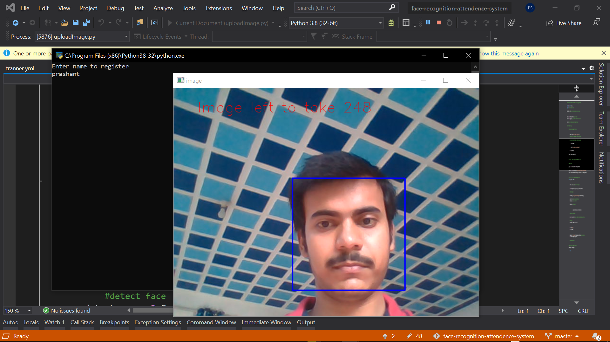
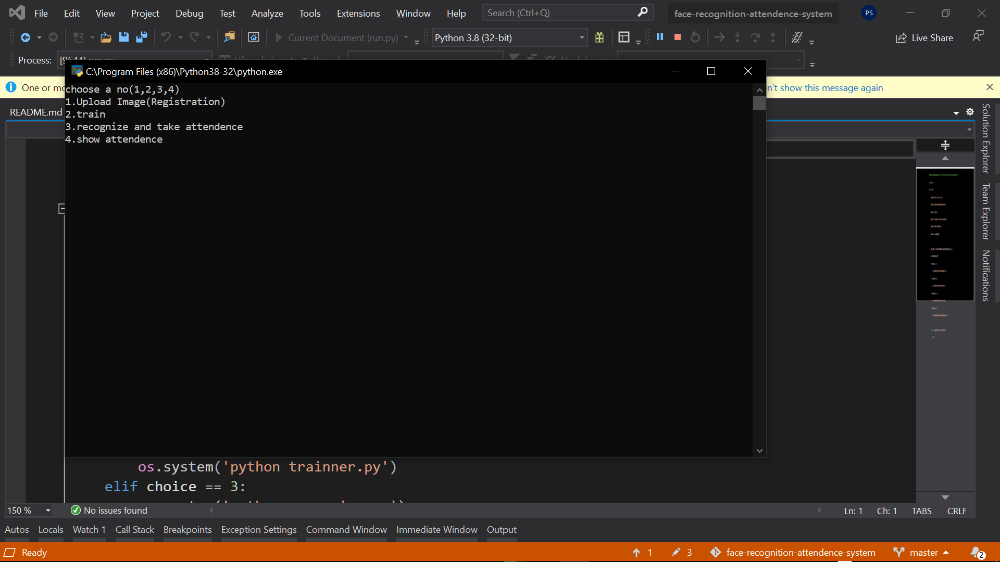

face-recognition-attendence-system
-----------------------------------
Collage Project
## It has the following modules.
### 1. uploadImage.py
       * For registration of new student.
       * It upload image and name of students.

### 2. trainner.py
       *It create a trainner with the help of images store.
       *It help to identify name of students by their faces.

### 3. recognizer.py
       *It recongnize and mark attendnece.
### 4. showAttendence.py
       *It display attendnece.
### 4. run.py
       *interface for user to run all modules.

